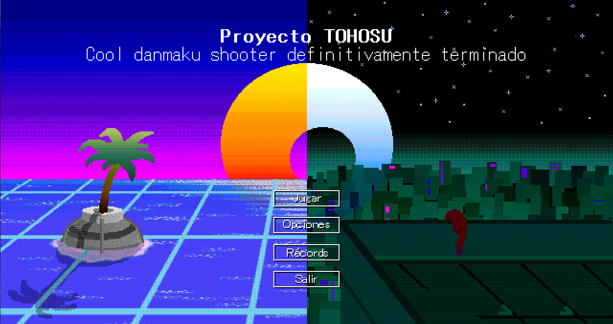
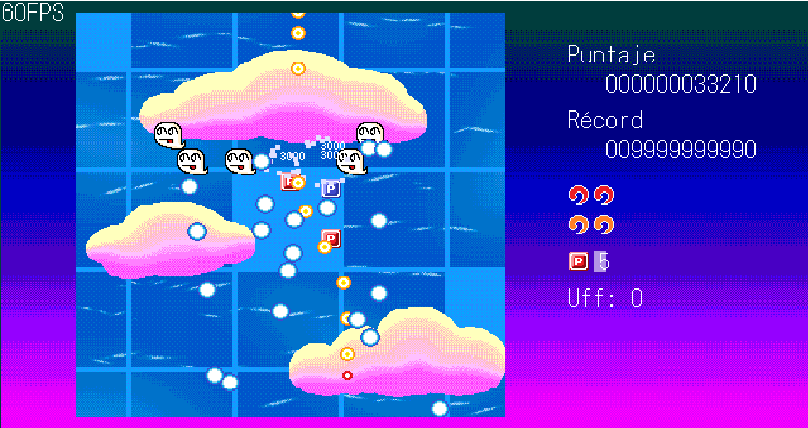
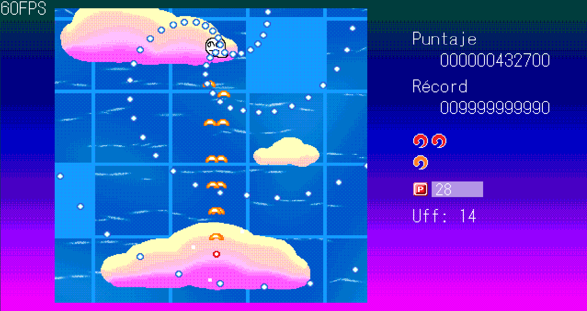
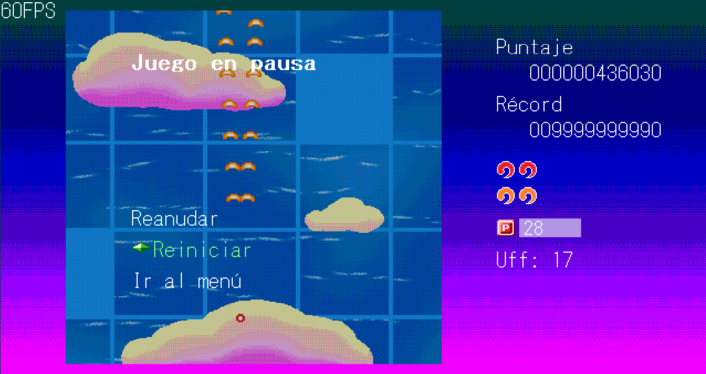
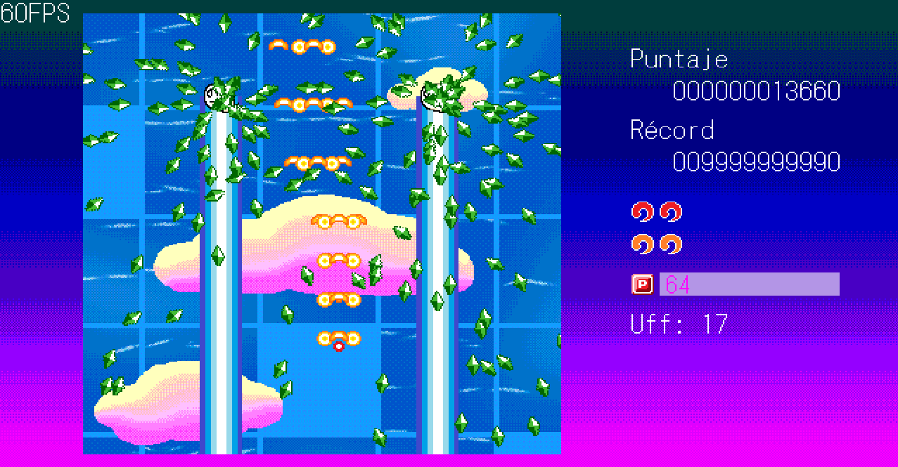

==========================================
---Proyecto TOHOSU--------------------------------
------Shoot Em' Up Danmaku hecho en Pygame
==========================================

HASTA AHORA:
1. ./main contiene la mayoria de archivos.
--- El juego es main/touhosu.py.
--- main/clases.py es la libreria con los objetos.
2. "Touhosu" como juego de palabras entre "Proyecto Touhou" y "Osu!" es un nombre temporal.

COSAS A MODIFICAR:
1. Añadir efectos de sonido.
2. Añadir mas enemigos.
3. Añadir jefes.

